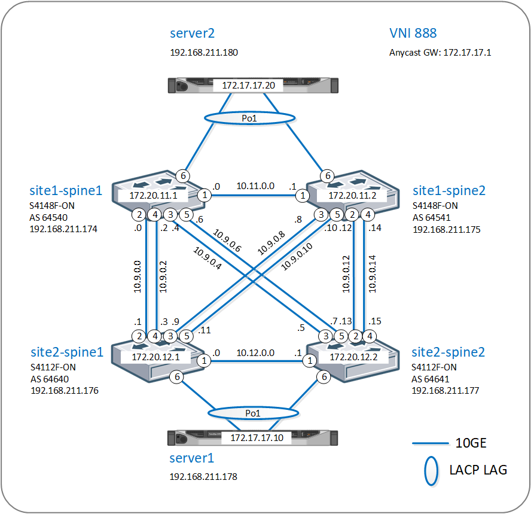

# Dell EMC Networking OS10 BGP EVPN VXLAN multi-site Example with Ansible Automation
This example shows configuration for 2 sites with BGP EVPN VXLAN for Layer 2 extension and Assymetric IRB (Integrated Routing and Bridging) using Ansible:
* Underlay protocol is eBGP
* Overlay protocol is eBGP
* EVI is manually configured
* VLT is configured for LAG to servers or other L2 switches
* Anycast gateway is configured for default gateway redundancy for virtual network 
* Ansible is used for configuration management and automation
* Switch 'show running-configuration' files are available in configs folder 
* Some Dell EMC Networking Ansible Roles was modified to add additional variables for UFD, BGP EVPN configuration. These roles are provided "AS IS". For original Dell Networking Ansible Roles visit https://galaxy.ansible.com/Dell-Networking
* dell-vxlan Ansible Role is written from a scratch and implements only necessary variables used in this example. It was tested for limited configuration scenario. This role is provided "AS IS".

## Network Topology

